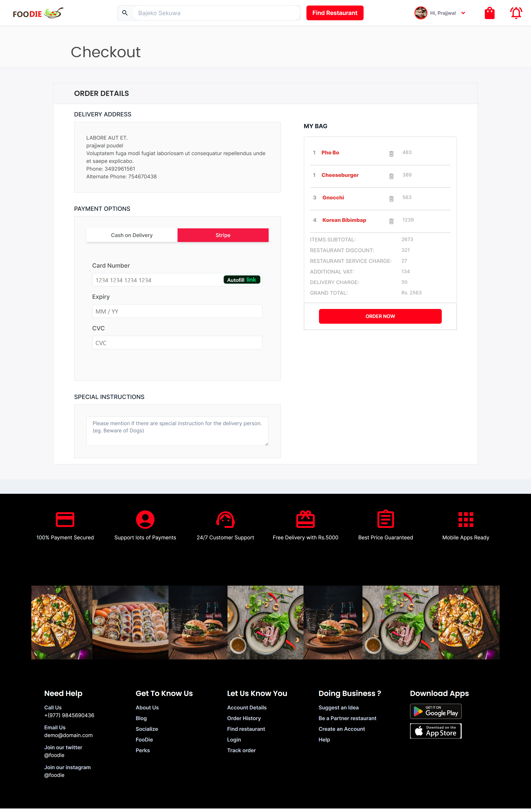
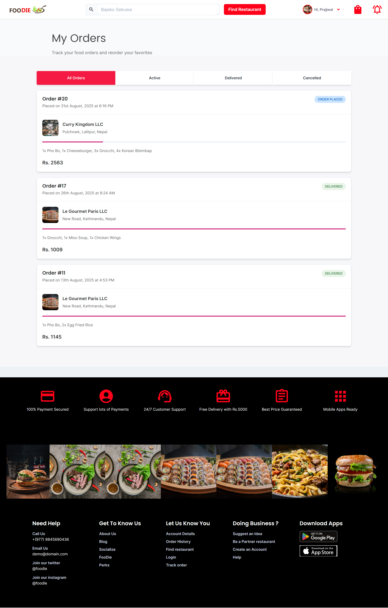

# 🍔 React Food Ordering Website ( Foodie )

A **modern food ordering web application** built with **React**, **Webpack**, and **SCSS**, focused on scalability and ease of feature development.

This repository contains the **frontend** of the application. The backend, including APIs and dashboards for **Super Admins, Restaurant Managers, and Delivery Riders**, is developed using **Laravel**. You can explore the backend project here: [Foodie API & Backend Dashboard](https://github.com/iamprazol/Food-Ordering-System-Api).


## 📸 Preview

Here’s a sneak peek of the app:

Click the images below to view the full version:
## 📸 Preview

Click the images below to view the full version:

| Home Page | Restaurant Details | Checkout Page | Orders Page |
|-----------|------------------|---------------|------------|
| [](./public/home-page.png) | <a href="./public/restaurant-details.png"></a> | [](./public/checkout.png) | [](./public/orders.png) |
| Home Page | Restaurant Details | Checkout Page | Orders Page |


🔗 **Foodie Live Demo**: [https://foodie.wpmake.net/](https://foodie.wpmake.net/)

---

## 🚀 Features

- ⚡ Built with **React + Webpack**
- 🎨 Styled with **SCSS**
- 🗂 Organized with **feature-based architecture**
- 🌍 Environment-based configs (`.env.development`, `.env.production`)
- 🔧 Configurable with **Babel** + **PostCSS**
- 📦 Modular structure for easy scaling

---

## 📂 Project Structure

```
src/
├── app/     		# App-level setup ( routing )
├── context/        # Global state (e.g. Cart, Auth)
├── features/     	# Domain-driven feature modules (e.g., cart, auth, menu)
├── pages/          # Page-level components
├── shared/     	# Reusable utilities, helpers, constants
├── widgets/        # UI building blocks
├── index.scss      # Global styles
└── index.js        # Entry point
```

---

## ⚙️ Installation & Setup

1. **Clone the repo**
   ```bash
   git clone https://github.com/iamprazol/react-food-ordering-website.git
   cd react-food-ordering-website
   ```

2. **Install dependencies**
   ```bash
   npm install
   ```

3. **Run the development server**
   ```bash
   npm run start
   ```

4. **Build for production**
   ```bash
   npm run build
   ```

---

## 🔑 Environment Variables

Create a `.env` file in the project root. Example:

```
REACT_APP_API_URL=https://api.example.com
REACT_APP_URL=http://localhost:8000/
REACT_FRONT_URL=http://localhost:3000/
REACT_APP_STRIPE_PUBLISHABLE_KEY=your-payment-key
```

---

## 🧪 Testing

*(To be added in future builds)*

---

## 🤝 Contributing

Contributions are welcome! Please read [CONTRIBUTING.md](./CONTRIBUTING.md) for guidelines.

---

## 📜 Changelog

See [CHANGELOG.md](./CHANGELOG.md) for version history.

---

## 📄 License

This project is licensed under the [MIT License](./LICENSE).

---
